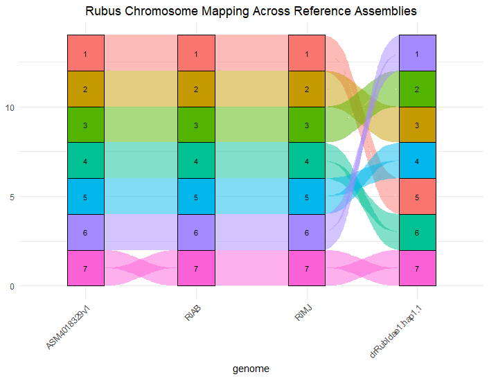
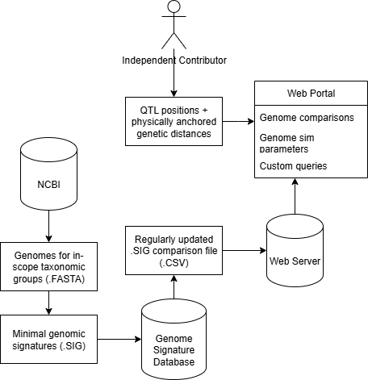

# GenomeBlueprints

GenomeBlueprints is a hobby project I've been working on to create a scalable curation framework for public genome accession data.
The primary objective is to bridge gaps between genomic research silos with a focus on general approximation, speed, and scalability.

Currently, this project is in its early stages of development, but I hope to see it grow with feedback into a useful community project that 
helps to bridge insights across independent research communities.

## Current Features
- **NCBI Genome Queries**: A module for retrieving bulk queries of genome fasta files and their metadata from NCBI.
- **Genome Signatures**: A module for generating genome signatures from fasta files, which are used for comparing genomes. 
- **Signature Comparison**: A module for comparing genome signatures to link collinear chromosomes and determine relative orientation.
- **Genomic Data Visualizations**: Multiple visualization modules for displaying genomic lexicons, query compositions, and karyotype summaries with mapped features.

Example: 

## Planned Features
- **PostgreSQL**: Integration with PostgreSQL for robust storage of genome signatures and genomic lexicons.
- **R Shiny App**: A user-friendly GUI for creating custom queries and visualizing genomic comparisons. This app may eventually be embedded into a community web portal.
- **Community Contributions**: A framework for community members to submit QTL and physically anchored genetic distances from their own research, which may be projected across genomes. 
 The objective is to provide quick approximate comparison to allow for hypothesis building and further investigation.
- **Genome Simulation Templates**: Based on a custom query, provide a standard set of parameters that may be used to construct genomes for breeding program simulation tools such as AlphaSimR.

## Planned Framework

